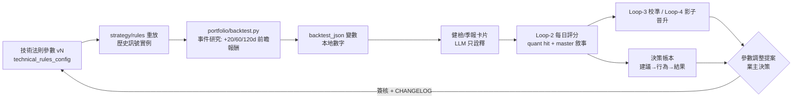
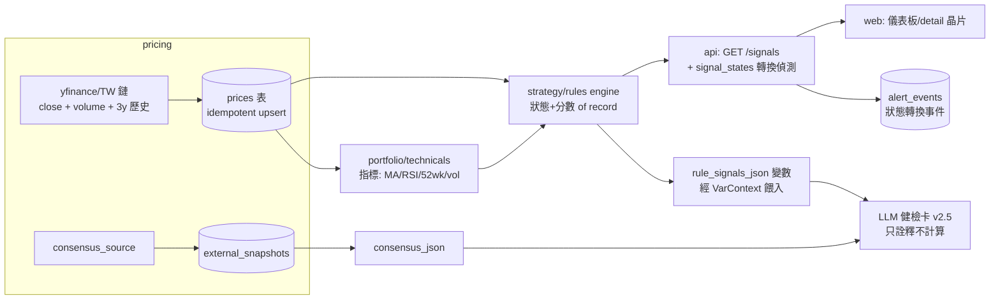
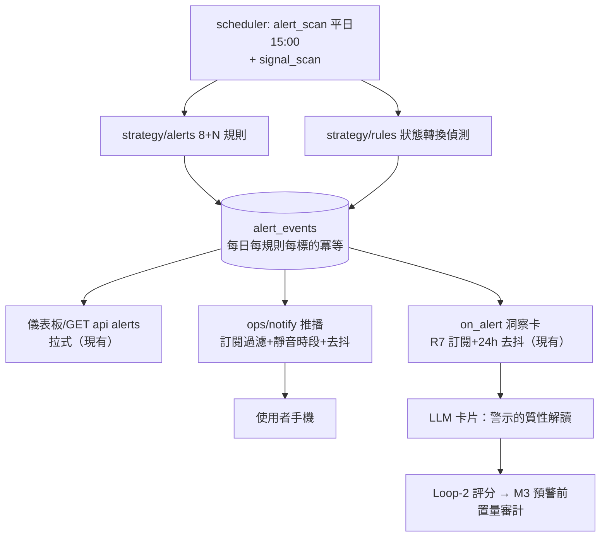

# AI 智能投資助手 — 完整發展藍圖

**日期:** 2026-07-06 · **基準:** branch `feat/task-pack-and-composer-cleanup`（v0.1.11 待出貨）· prod = v0.1.10（LLM 依設計休眠中）
**性質:** 規劃文件（決策就緒版）。本文不改任何鎖定決策；凡涉及鬆動之處，一律列為第 10 節的明確決策請求。
**依據:** 全庫能力盤點（strategy / portfolio / llm_insight / pricing / scheduler / api / web 逐檔清查）+ 業界實證研究（引用於各節）。

---

## 1. 願景與誠實的目標函數

### 1.1 願景三支柱（業主原意）

| # | 支柱 | 意涵 |
|---|------|------|
| P1 | 智能倉位監控 | 主動的、適時的投資提示與風險預警 —— 不是等使用者打開網頁才看得到 |
| P2 | 智能技術線投資法則 | 市場標準技術分析法則引擎，對**長期持倉**產出進場／加碼／減碼／出場的評估情境 |
| P3 | 最佳長期投資建議 | 設計的終極目的：協助做出最佳長期決策，以**長期報酬率極大化**為首要目標函數 |

### 1.2 誠實界定：顧問型助手能因果影響什麼

「報酬率極大化」若不誠實地操作化，會變成無法驗證的行銷語言。實證文獻給出清楚的分界：

**助手可因果影響的（有實證支撐）：**

| 槓桿 | 實證依據 | 量級 |
|------|----------|------|
| 行為紀律（防追高殺低） | Morningstar *Mind the Gap*（十年期投資人報酬落後基金本身約 1.2pp/年）；DALBAR QAIB（30 年期散戶落後 S&P 500 約 4pp/年，主因擇時錯誤） | **每年 1~4pp** —— 個人投資者最大、最可靠的可回收報酬 |
| 行為教練價值 | Vanguard *Advisor's Alpha*：顧問總附加價值約 3pp/年，其中**行為教練單項 ≥1.5pp**，是最大成分 | ≥1.5pp/年 |
| 風險迴避（回撤控制） | Faber 10 個月 SMA（QATAA）：報酬近似 buy-and-hold（10.5% vs 9.9%），但**回撤與波動降至債券級**；Zakamulin 全面回測：MA 類法則的主要價值是風險控制而非打敗大盤 | 報酬近似 + 回撤大減 |
| 紀律化再平衡 | Swedroe 5/25 法則（偏離目標 5 個絕對百分點或 25% 相對即再平衡）：控制風險漂移、順帶收割波動 | 風險控制為主 |
| 決策品質校準 | Annie Duke（process vs outcome、反 resulting）；Brier score / decision journal：命中率與信心校準只有累積成序列才能區分技巧與運氣 | 長期改善判斷品質 |

**助手不能承諾的（誠實限制，詳見 §9.3）：**

- 市場報酬本身。技術訊號在**個股層級比指數層級雜訊更多**（黃金交叉 66 年 S&P 回測僅 33 次訊號、勝率倚賴量能確認：高量確認 72% vs 低量 54%；死亡交叉短期有效、30 天後與隨機無異；訊號本質滯後）。
- 每次判斷都正確。趨勢法則的代價是盤整期 whipsaw；12-1 月動能（Moskowitz TSMOM、Antonacci dual momentum）是最有長期證據的因子，但同樣有失效期。

### 1.3 目標函數的正式定義

> **max E[長期報酬率] ，經由助手可控的三個槓桿：**
> **決策品質（訊號＋校準） × 風險迴避（回撤／集中度／FX） × 行為紀律（防錯時機操作）**
>
> 助手的操作化目標 = **最大化「風險調整後決策品質」**，其對長期報酬率的提升是統計期望，不是保證。
> 產品立場維持既定鎖定決策：**方向性判讀 + 條件情境框架**——不是自動下單機、不給部位大小指令。

### 1.4 可量測代理指標（proxies）

全部在本地計算（invariant #1），LLM 只敘事：

| 代理指標 | 定義 | 現有底座 | 缺口 |
|----------|------|----------|------|
| M1 決策命中率＋校準誤差 | Loop-2 `ai_score`（quant hit + master narrative 0-100）＋ `calibration_error`（宣稱信心 vs 實際命中，pp）——Brier 思想 | **已建**（evaluations_store、rubric v2 = 方向40/數字30/條件20/時間10） | 樣本數 ≈ 0（prod 未點火） |
| M2 基準相對 XIRR 差值 | 組合 XIRR −「同現金流買指數」的基準 XIRR（成本加權 TAIEX/SPX/KLCI 混成，交易日匯率換算，與 domain-ledger XIRR 規則一致） | `portfolio/returns.py::xirr_reporting` 可複用 | **無基準重放計算**（Phase 4） |
| M3 預警前置量 | 風險警示發出 → 其後 N 日實際回撤的事件研究（警示有沒有走在虧損前面） | `alert_events` 已有事件流水 | 無回顧分析（Phase 4） |
| M4 行為紀律指標 | 從**交易帳本推斷**使用者行為 vs 建議／警示（如極度恐慌區賣出、紅旗警示後逆向操作次數） | 帳本齊全、F&G 區間已算 | 無關聯分析（Phase 4 決策帳本） |
| M5 成本紀律 | LLM 花費（`llm_usage` 已逐筆記帳）＋ 費稅拖累可視化 | **已建** | 僅呈現面補強 |

---

## 2. 現況能力盤點（2026-07-06，branch 基準）

### 2.1 計算核心與資料層

| 能力 | 狀態 | 位置 |
|------|------|------|
| 成本基礎（加權平均、original/adjusted 雙軌）、已實現/未實現 P&L、總報酬、XIRR（FX-aware）、FX 損益歸因 | ✅ 完整 | `portfolio/`、`forex/` |
| 現金池（第五帳本）、月度 KPI 快照、股利推播匣、稅務匯出 | ✅ | `portfolio/cash.py`、`snapshot_monthly`、`export/` |
| 報價來源鏈 | ✅ US: yfinance→stockprices_dev；TW: twse→tpex→yfinance→twstock；MY: yfinance→klsescreener→malaysiastock | `pricing/defaults.py` |
| **歷史回填** | ⚠️ quick-register 365d；`history_daily` 只補近 7d；深回填靠手動 `POST /api/actions/backfill-history`；**QUOTE_HISTORY 只有 yfinance 一家（單點）** | `instrument_service.py:43`、`jobs.py` |
| **成交量** | ❌ `prices.volume` 欄位存在，**沒有任何 provider 回填**（demo 3181 筆價格、0 筆有量）；`volume_signal` 是刻意留好的乾淨接縫 | `pricing/schema.py:6`、`technicals.py` |

### 2.2 訊號與監控

**技術指標（`portfolio/technicals.py`，純 Decimal、資料不足誠實降級）：** MA20/60/120、RSI14(Wilder)、MA20/60 黃金/死亡交叉+days_ago、52 週位置（誠實視窗）、趨勢結構 HH-HL/LH-LL、30d 年化波動、90d 最大回撤、price_vs_cost、`volume_signal`（探測門控、目前無資料）。生成路徑餵 **400d** 收盤（`_TECHNICAL_HISTORY_DAYS=400`，但庫內最多只有 365d）；`price_history_json` 變數維持 180d 降採樣。

**外部訊號（`portfolio/external_signals.py`）：** FinMind 籌碼五件套（法人連買/融資券/PER-PBR 百分位/月營收 YoY-MoM/財報，TW 為主）、VIX 分區、CNN F&G 分數+本地五區+7 日趨勢、TAIEX/SPX/KLCI 指數。

**警示引擎（`strategy/alerts.py` + `rules_config.py`）— 現有 8 條規則：**

| 規則 | 預設 | 嚴重度 | 性質 |
|------|------|--------|------|
| single_weight | 30% | risk | 單一持股權重上限 |
| sector_weight | 60% | risk | 產業權重上限 |
| stale_price / missing_price | 開關 | warn | 資料新鮮度 |
| fx_drift | 3% | info | 現匯 vs 平均成本匯率漂移 |
| exdiv_upcoming | 14d | info | 除息臨近 |
| quota_low | $1 門檻 | warn/risk | LLM 額度 |
| calib_gap | 15pp | warn | AI 校準誤差（API 層餵入，strategy/ 不 import llm_insight） |

**觸達方式：純拉式。** 儀表板嵌入 + `GET /api/alerts` + `alert_scan`（平日 15:00）→ `alert_events` → on_alert 洞察卡（24h 去抖、每日 ≤3）。**全庫 grep 確認：無 email/webhook/Telegram/推播任何形式的出站通道。**

**strategy/ 現況：** `rules_config` / `alerts` / `whatif`（買賣試算，重放真帳本+真費稅引擎）/ `rebalance`（目標權重→整股交易預覽，MY 100 股整批）。**尚無技術法則引擎**——technicals 目前只作為 LLM 變數，不是有狀態、有分數、可回測的 signals of record。

### 2.3 LLM 洞察管線（四迴路已閉合，等真實資料）

| 迴路 | 內容 | 狀態 |
|------|------|------|
| Loop-1 生成 | R1-R8 閘門（scope×變數/宇宙/停用/缺價/降級/額度/on_alert 訂閱/多目標展開）、fingerprint 快取（同交易日+同資料=0 花費）、預算硬上限（Σtopup−Σusage ≤0 即擋） | ✅ live 驗證過 |
| Loop-2 評分 | `score_quant` 純量化 + master LLM 敘事評分（rubric v2：方向 40／數字引用 30／條件情境 20／時間性 10；anti-poison：pending 永不強判、undetermined 不計分） | ✅ 建成，**樣本≈0** |
| Loop-3 校準 | min_samples 門檻 + 連續 3 miss 或 miss 率>gap_alert_pp 觸發；master 寫新校準版（denylist：加碼/減碼/買進/賣出/停損停利… 先行）+ LLM 驗證 | ✅ |
| Loop-4 影子/晉升 | shadow 版本、不劣則晉升、`calibration_regression`（近期 miss 率-基線 >20pp）事件警示 | ✅ |

**變數註冊表：32 變數／9 類**（position 6、price 5、dividend 3、fx 2、chips 5、sentiment 3、news 1、ai 2、system 5）。30 個 live；**`backtest_json` 與 `calibration_gap_json` 兩個 ai 類 = `available=False`**（本藍圖 Phase 4 點亮）。

**官方模板庫 `official_templates.py`（LIBRARY_VERSION = official-v3）：** 系統提示 v2（時效優先）、持倉週報策略 v2.1、**個股健檢策略 v2.3（含第六節「加碼／減碼參考框架」：條件+方向、不給部位、不下單）**、市場週報策略 v1.1（單位如實引用防護）、新聞整理提示 v1；官方任務套組三件（週報 sat 09:00／健檢 mon 09:00／市場週報 sat 09:30）一鍵啟用。

**新聞管線（batch ④）：** 抓取→AI 整理→獨立 `news.db`→`symbol_news_json` 變數→新聞庫頁面；實測 43 篇 $0.154。

### 2.4 排程與部署

17 個靜態 job（三市場收盤報價、history/dividends/inbox、FinMind 三件、sentiment/index、alert_scan、evaluate_insights、generate_calibrations、backup、news_daily）+ 動態 `insight:{id}` cron。雙環境迴圈（dev 重閘門→test 站行為驗證→綠燈才 promote tag 到 prod）成熟運轉；**prod LLM 依設計休眠（等業主點火：key＋6 角色＋儲值＋一鍵官方套組）**。

### 2.5 一句話總結現況

> 「記帳與計算」和「LLM 敘事管線」兩根柱子已是生產級；**「訊號的深度（量、長歷史、法則引擎）」「主動觸達（推播）」「自我驗證（回測、基準對比、決策帳本）」三塊是通往願景的主要空白**——且 Loop-2/3 的一切改進都被 prod 未點火卡住樣本數。

---

## 3. 差距分析

### 3.1 能力矩陣（願景 → 現況 → 差距 → 嚴重度）

| 願景要求 | 現況 | 差距 | 嚴重度 |
|----------|------|------|--------|
| **P1 適時主動提示** | 純拉式；警示只在站內 | **無任何推播通道**——「適時」在使用者不開網頁時不成立 | 🔴 高 |
| P1 風險預警廣度 | 8 條規則（權重/新鮮度/FX/除息/額度/校準） | 缺：個股高點回撤、波動突升、再平衡帶漂移（5/25）、趨勢狀態改變事件、共識變化、新聞重大性 | 🟠 中高 |
| P1 建議適時性 | on_alert 卡片（24h 去抖） | 無每日收盤摘要／每週行動清單的「彙整式」觸達 | 🟡 中 |
| **P2 法則引擎** | technicals 是 LLM 變數，非 signals of record | **`strategy/` 的設計本位（參數化純 Python 法則模組）幾乎空白**：無狀態機、無綜合評分、無事件轉換偵測 | 🔴 高 |
| P2 量能維度 | `volume` 欄有、無資料 | 黃金交叉等法則的量能確認（實證 72% vs 54%）完全不可用 | 🔴 高 |
| P2 歷史深度 | 回填 365d；technicals 讀 400d | **MA200／完整 52 週勉強及格，回測不可能**；週線視角缺席 | 🔴 高 |
| P2 指標廣度 | MA/RSI/交叉/52週/趨勢結構 | 缺 MA200 趨勢濾網（含遲滯帶防 whipsaw）、12-1 月動能；MACD/BB 等未納（刻意，見 D3） | 🟡 中 |
| **P3 報酬率極大化的可驗證性** | XIRR 有；Loop-2 rubric 有 | **無基準相對 XIRR 差值**（M2）、**無回測引擎**（`backtest_json` 停用）、**無決策帳本**（建議→行為→結果） | 🔴 高 |
| P3 風險度量深度 | 30d vol + 90d maxDD + 權重規則 | 缺個股 drawdown-from-peak、HHI 集中度、FX 曝險壓力呈現 | 🟡 中 |
| P3 評估迴路成熟度 | 四迴路建成 | **真實樣本 ≈ 0（prod 休眠）**——一切校準、rubric 迭代都缺燃料 | 🔴 高（阻塞） |
| P3 行為護欄 | 模板內隱含 | 無顯性「冷靜檢查」卡（如極度恐慌區+使用者近期賣出行為的組合提示） | 🟡 中 |

### 3.2 資料差距

| 資料 | 現況 | 需要 | 去處 |
|------|------|------|------|
| 成交量 | 0 筆 | 三市場回填（yfinance 有 volume；TW 可 TWSE/FinMind `Trading_Volume` 補強） | Phase 1 |
| 價格歷史 | ≤365d | ~3 年（MA200＋52 週＋事件研究的最低誠實樣本） | Phase 1 |
| 分析師共識（既定佇列⑤） | 無 | yfinance targets/recommendations（US 佳、TW 部分、MY 稀薄→誠實降級） | Phase 1 |
| 外部報告 Vision 餵入（既定佇列⑥） | 無 | vision 角色解析 + 人工確認入庫（沿用 input-center 前例） | Phase 5 |
| news.db 保留策略 | 未定（已記錄的 LOW） | 保留/輪替政策 | Phase 3 順帶 |

### 3.3 流程差距

- **prod 點火未完成**（阻塞項）：M1 樣本、Loop-3 校準、rubric 迭代全部等它。
- Loop-2 尚年輕：rubric v2 剛上線，時效維度是新加的；需要真資料跑幾週才能談第一次校準。
- 模板預覽路徑（`prompts.py`）technicals 仍讀 180d（已知小缺口，與生成路徑 400d 不一致）。

---

## 4. 完整發展藍圖（Phase 0 → 6）

### 4.0 總覽

| Phase | 名稱 | 規模 | 依賴 | 對應支柱 |
|-------|------|------|------|----------|
| 0 | 出貨與點火（阻塞） | S | — | 全部（樣本燃料） |
| 1 | 資料地基：量＋長歷史＋共識⑤ | M | 0 | P2、P3 |
| 2 | 技術法則引擎（strategy/rules） | L | 1 | P2 |
| 3 | 智能監控升級：警示 v2＋推播＋摘要 | M-L | 2（部分可先行） | P1 |
| 4 | 回測與決策品質迴路 | L | 1、2 | P3 |
| 5 | 外部報告 Vision 餵入⑥ | M | 0（獨立） | P3 |
| 6 | 長期建議綜合層 | M | 4 | P3 |

規模單位 = 本 repo 的「批次」節奏（S ≈ 1 批、M ≈ 2-3 批、L ≈ 3-5 批；一批 = mini-spec→實作→閘門→demo 驗證→SR 的完整迴圈）。

---

### Phase 0 — 出貨與點火（S，**阻塞建議**）

- **目標：** branch 上已綠的 ①②③④（任務套組／per_market／技術訊號＋F&G／新聞管線）以 v0.1.11 出貨到 prod；業主完成 prod LLM 點火（runbook §6：key→6 角色→儲值→一鍵官方套組→掛週排程）。
- **進入條件：** branch 全閘門綠（現況已達）。
- **退出條件：** `verify_live --expect-version 0.1.11` 全過；prod 每週產卡；`/api/ai-score` 樣本數開始累積。
- **為何阻塞：** M1（命中率/校準）是整個「報酬率極大化」論證的量測底座；每晚一週點火，Loop-2/3 的資料就晚一週。**建議：在 Phase 1 動工前完成。**

### Phase 1 — 資料地基（M）

- **範圍：** ① volume 回填（yfinance provider 的 history/latest 帶出 volume，TW 鏈補強；一次性深回填 action）；② 歷史加深 365d→約 1,100d（3 年，config 化）；③ 分析師共識變數（佇列⑤：`consensus_json` per_symbol，snapshot 模式，數字一律 API 取得——符合 invariant #1）。
- **退出條件：** 持有標的近 90d volume 覆蓋率 >90%；`technical_signals_json` 出現 volume 節；52 週視窗達 252；健檢 v2.4 引用共識（MY 誠實顯示無覆蓋）。
- **附帶修復：** 預覽路徑 technicals 讀窗與生成路徑對齊（180→400d）。

### Phase 2 — 技術法則引擎（L，P2 的本體）

- **範圍：** `strategy/rules/` 新子套件——參數化純函數法則模組 + 綜合評分 + 評估情境（entry/add/trim/exit-watch）+ 狀態轉換事件。v1 法則集（見 D3，建議「實證核心四件」）：
  1. **趨勢濾網**：價格 vs MA200（Faber/Zakamulin 傳統），加**遲滯帶（如 ±2%）或 N 日確認**抑制 whipsaw；
  2. **均線交叉**：50/200（黃金/死亡）＋**量能確認**（高量 72% vs 低量 54% 的實證直接編碼為 confidence 修飾）；沿用既有 20/60 為短窗參考；
  3. **12-1 月動能**：Moskowitz TSMOM／Antonacci 實證最強的長期因子，作為持有續抱/減碼的傾向分量；
  4. **RSI 區間＋52 週位置**：超買超賣與高低點接近度，作為情境上下文而非獨立進出訊號。
- 綜合輸出：每持股一份 `SymbolSignals`（各法則狀態＋貢獻分＋TechScore 0-100＋evaluation_context），**參數版本戳記隨結果攜帶**（重算可還原，比照費稅快照精神）。
- **退出條件：** signals of record 由本地決定；`rule_signals_json` 變數上線；健檢 v2.5 引用（LLM 只詮釋）；狀態轉換（如趨勢由上轉下）進 `alert_events`；純 fixture 測試覆蓋黃金交叉／whipsaw／資料不足三族。

### Phase 3 — 智能監控升級（M-L，P1 的本體）

- **範圍：** ① 警示分類法 v2：個股高點回撤、波動突升、再平衡帶漂移（Swedroe 5/25，需目標權重設定，見 D8）、Phase 2 訊號轉換事件、共識變化；② **推播通道**（D1：ntfy／Telegram／email 三選，建議 ntfy）：`ops/notify.py` 葉子模組（比照 `ops/backup.py`），alert_scan 後派送，靜音時段＋每規則訂閱＋去抖；③ 每日收盤摘要（確定性組裝，LLM 摘要一句可選）＋每週行動清單卡。
- **退出條件：** 真事件在 alert_scan 後 N 分鐘內到達使用者手機；退訂即停；無重複轟炸（複用 24h 去抖模式）；news.db 保留政策落地。

### Phase 4 — 回測與決策品質迴路（L，P3 的可驗證性）

- **範圍：** ① `portfolio/backtest.py` **事件研究引擎**（D4）：法則訊號實例 → +20/+60/+120 交易日前瞻報酬分布 vs 無條件基線；誠實防護（最小樣本數、重疊樣本註記、不做年化表演）；② `portfolio/benchmark.py`：同現金流重放買指數 → 基準 XIRR → **M2 差值**；③ **決策帳本**（D6）：從交易帳本推斷使用者行為，關聯建議卡（方向＋時限）→ 行為 → 結果，擴充 Loop-2 至「建議層」而非只有「卡片層」；④ 點亮 `backtest_json`＋`calibration_gap_json`（32 變數全數 live），ai-score 頁升級為決策品質儀表。
- **退出條件：** 健檢卡引用回測數字（本地算）；儀表板出現 M2/M3 KPI 磚；決策帳本月報可產出。

### Phase 5 — 外部報告 Vision 餵入（M，佇列⑥）

- **範圍：** 上傳 PDF/截圖 → vision 角色解析 → **人工確認入庫**（完全沿用 AI 對帳單解析的 preview→confirm 前例；解析出的數字經確認才成為 record——invariant #1 合規慣例，見 D9 記錄）→ 質性快照＋可選結構化共識列 → `symbol_report_json` 變數 → 健檢引用。
- **退出條件：** 一份真實券商報告完整走通；未確認的解析數字永不進計算。

### Phase 6 — 長期建議綜合層（M）

- **範圍：** ① 季度深度報告模板（風險分解：集中度 HHI／FX 曝險／個股回撤；估值疊加：PER 百分位＋共識 vs 技術面；行為回顧：M4 指標 vs 行為缺口文獻）；② 行為護欄卡（例：F&G 極度恐慌區 × 使用者近 7 日有賣出 → 冷靜檢查提示）；③ what-if 與建議掛鉤（減碼情境一鍵試算）。
- **退出條件：** 首份季度報告產出；決策品質趨勢圖可視。

### 4.1 回測—評估迴路（Phase 4 核心流）



---

## 5. 模組規劃劃分（映射到鎖定架構）

依賴方向不變：`web → api → {strategy, portfolio, llm_insight} → pricing → shared`；`strategy/` 永不 import `llm_insight`（calib_gap 前例：由 api 層餵）；`llm_insight` 只讀已算好的數字。

### 5.1 `strategy/rules/`（新子套件——法則引擎，Phase 2）

| 檔案 | 職責 |
|------|------|
| `params.py` | 凍結參數模型：`TrendFilterParams(ma=200, band=0.02, confirm_days=2)`、`MaCrossParams(fast=50, slow=200, volume_confirm=True)`、`MomentumParams(lookback_m=12, skip_m=1)`、`RsiParams(14, 70, 30)`、`CompositeWeights` |
| `trend_filter.py` / `ma_cross.py` / `momentum.py` / `rsi_regime.py` | 各法則純函數：`closes(+volumes) → RuleState{state, score, evidence, window_days}`；資料不足 → 誠實 `None` |
| `composite.py` | TechScore 0-100 + 貢獻分解 + evaluation_context（對映健檢加碼/減碼框架的條件語彙） |
| `engine.py` | `evaluate_symbol(closes, volumes, params) → SymbolSignals`；`params_version` 戳記隨結果攜帶 |

- **公開接縫：** api 層讀價後呼叫（比照 `insight_service` 餵 closes 的既有模式）；`signal_states` 小表存「上次狀態」以偵測轉換（**衍生快取、可重建**，真相仍是 prices——遵守 computed-on-read 原則的既有快取豁免寫法）。
- **測試策略：** 合成序列 fixtures（單調升／whipsaw 鋸齒／不足 N 天／量能有無四族）；property 式邊界（空序列、單點、全等值）。
- **約束不變量：** #1（數字本地算）、#4（不 import 上層）、Decimal、mypy strict。

### 5.2 `portfolio/`（新增純計算，Phase 4）

| 檔案 | 職責 | 測試 |
|------|------|------|
| `risk.py` | 個股 drawdown-from-peak（誠實視窗）、HHI 集中度、再平衡帶漂移（5/25，讀目標權重 config） | 固定 fixtures |
| `backtest.py` | 事件研究：訊號實例 → 前瞻報酬分布、hit-rate、vs 無條件基線；最小樣本門檻、重疊樣本註記 | 合成價格序列、已知答案 |
| `benchmark.py` | 現金流重放買指數 → 基準 XIRR（複用 `xirr_reporting` 與交易日 FX 規則）→ M2 差值 | 黃金流量 fixtures |

### 5.3 `pricing/`（Phase 1）

- `yfinance_provider`：history/latest 帶出 `volume`（`PriceRow.volume` 已預留、`upsert_prices` 已會寫——**純接線**）；TW 鏈補強量能來源。
- 歷史深度：`HISTORY_BACKFILL_DAYS` 365→config（建議 1,100）；`/api/actions/backfill-history` 支援深回填參數。
- `consensus_source.py`：spec-20 snapshot 模式（SOURCE_INFO＋probe＋idempotent upsert＋health 降級）。
- **約束：** 唯一寫價格/FX 的模組；4dp/6dp 噪音帽不變；volume 為整數字串（非 money，不受 2dp 規則）。

### 5.4 `llm_insight/`（各 Phase 增量）

- 變數：`rule_signals_json`（per_symbol，Phase 2）、`consensus_json`（Phase 1）、`risk_json`（Phase 4）、`symbol_report_json`（Phase 5）；點亮 `backtest_json`／`calibration_gap_json`（Phase 4）。每加一變數 = registry＋`web/vars.js`＋**var-count contract tests 同步改**（32→N 的既有慣例）。
- 模板：健檢 v2.4（共識）→ v2.5（法則訊號）→ v2.6（回測數字）；季度深度報告策略 v1（Phase 6）。**一律走 official_templates 位元組凍結＋版本戳＋reset-to-official**，不churn 快取指紋。
- Loop-2 rubric：Phase 4 增「與法則訊號一致性」評分維度時，rubric 版本 v3 並記入 CHANGELOG。
- **約束：** #1/#2/#3（LLM 不產數字、batch-only、全快取）；external 值一律經 `VarContext.external_vars` 餵入。

### 5.5 `api/` + `web/`（各 Phase 增量）

- `GET /api/signals`（全持股 SymbolSignals）＋ detail drawer 訊號晶片＋儀表板監控面板（Phase 2/3）。
- 通知設定：`settings-alerts` 增「通知」節（通道／訂閱／靜音時段）；secrets 走既有 config_store＋`shared/masking`。
- Vision 報告餵入：沿用 input-center 的 preview→confirm 介面模式（Phase 5）。
- **約束：** 路由零業務邏輯；金額 Decimal 字串；前端不算錢。

### 5.6 `scheduler/` + `ops/`

- 新 job：`consensus_daily`（Phase 1）、`signal_scan`（Phase 2，或併入 alert_scan 前段）、`digest_daily`／`digest_weekly`（Phase 3）。
- `ops/notify.py`：葉子模組（如 `ops/backup.py`），單一 `send(title, body, sev, link)` 接縫；scheduler 經注入 runner 呼叫（不 import api）。傳輸層 mock 測試；ntfy = 純 HTTP POST（stack 內 httpx，可 self-host，**不新增重依賴**）。

### 5.7 法則引擎資料流（Phase 1+2 全景）



---

## 6. 實作步驟指南與流程指南

### 6.1 標準批次迴圈（本 repo 已驗證的既定流程，逐批照走）

1. **mini-spec**（手機可讀的白話 artifact，含預設值與退出條件）→ **業主確認**後才動工（spec-first）。
2. `main` 切新分支（promote 後先開分支的既定規則，op-log #28）。
3. TDD 實作：測試先行/同行；純計算 = fixture 單元測試；外部邊界 = mock。
4. **DEV 重閘門：** `.venv` python 跑 `pytest`（full excl e2e）＋ 變更頁 e2e 子集 ＋ `mypy --strict` ＋ `ruff`。
5. 部署 **demo/test 站**（部署本身是第一道環境閘門：install＋boot＋`/api/health`）。
6. **站外行為驗證：** `scripts/verify_live.py <test-url>` ＋ 真瀏覽器點擊變更流程（雙視口）。
7. **SR / 深度審查**（高風險包用 subagent 深審，見 §7）→ fix-forward → 重綠。
8. 批次在分支上累積（bundle 策略沿用 v0.1.11 模式）→ `/ship-version`（CHANGELOG `grep -c "^## \[v"` 完整性、真實交付日期、LESSONS）→ **prod 部署 tag** → `verify_live <prod-url> --expect-version`。

### 6.2 每批固定檢查清單

- [ ] mini-spec 已確認（含不做什麼）
- [ ] 新變數 ⇒ registry＋vars.js＋var-count contract tests＋`/api/prompt-vars` 實測同步
- [ ] 模板變更 ⇒ official_templates 版本戳＋位元組凍結＋reset 不 churn 指紋的回歸測試
- [ ] 新表/欄 ⇒ ALTER-if-missing 慣例＋golden_db 建空表使套件維持綠
- [ ] 金額/比率 Decimal 字串；比率≠金額（不受 2dp 規則）
- [ ] 層向 sweep：無下層 import 上層；strategy ↛ llm_insight
- [ ] 排程新 job ⇒ test 站 scheduler 停用下手動觸發驗證
- [ ] CHANGELOG 條目＋計數驗證；涉及規則/費率/參數變更 ⇒ 決策記錄

### 6.3 各 Phase 步驟要點

| Phase | 關鍵步驟順序 |
|-------|--------------|
| 0 | `/ship-version` v0.1.11 → prod tag → verify → **業主點火**（runbook §6）→ 掛週排程 → 一週後首次 Loop-2 樣本檢視 |
| 1 | 量能接線（provider→PriceRow.volume）→ 深回填 action → 探針驗證三市場 → 共識 snapshot 源 → 變數＋健檢 v2.4 → demo 實測 volume 節出現 |
| 2 | params/engine 純模組（先測試後實作）→ 深審 → API/晶片 → 變數＋v2.5 → 轉換事件進 alert_events → live 驗證卡片引用訊號 |
| 3 | 警示 v2（純 strategy 擴充）∥ notify 葉子模組 → 設定 UI → alert_scan 派送接線 → 手機實收驗證 → 摘要卡 |
| 4 | backtest 引擎（合成序列黃金測試）→ benchmark 差值 → 決策帳本 → 點亮 2 個 ai 變數 → ai-score 頁升級 |
| 5 | vision 解析（沿用 input-center preview→confirm）→ 快照store → 變數 → 真報告走通 |
| 6 | 季報模板 → 行為護欄卡 → what-if 掛鉤 |

---

## 7. 派工方案（AI-agent 工作包切分）

原則：**一包 = 一分支一批次**；檔案不相交才並行（worktree 隔離的既定作法）；每包有可機器驗收的標準；高風險包（★）加 subagent 深審閘門。

| WP | 內容 | 相依 | 並行 | 驗收標準 | 深審 |
|----|------|------|------|----------|------|
| 0 | v0.1.11 出貨＋點火支援 | — | — | prod verify 全過；ai-score 樣本>0 | — |
| 1A | volume 接線＋深回填 | 0 | ∥1C | 持有標的 90d 量覆蓋>90%；upsert 冪等不變 | — |
| 1B | 歷史 365→1100d config | 1A（同檔） | — | 52wk window=252；儲存量評估記錄 | — |
| 1C | 共識 snapshot 源＋變數＋健檢 v2.4 | 0 | ∥1A | MY 誠實降級；數字全來自 API | — |
| 2A | 法則引擎核心（rules/ 純模組） | 1A,1B | — | 四族 fixtures 全綠；params_version 戳記 | ★（法則正確性） |
| 2B | signals API＋UI 晶片＋轉換事件 | 2A | ∥2C | /api/signals 契約測試；事件進 alert_events | — |
| 2C | rule_signals_json＋健檢 v2.5 | 2A | ∥2B | var-count 測試；卡片引用訊號 live 驗證 | — |
| 3A | 警示分類法 v2 | 2B | ∥3B | 每規則單元測試＋單源相等測試 | — |
| 3B | ops/notify＋設定 UI＋派送 | 0 | ∥3A | 手機實收；退訂即停；secrets 遮罩 | ★（安全/秘密/出站） |
| 3C | 每日摘要＋週行動清單 | 3A,3B | — | 零 LLM 也可產出（LLM 摘要可選） | — |
| 4A | 事件研究回測引擎 | 2A | ∥4B | 合成序列已知答案；最小樣本門檻 | ★（正確性+防過擬合表演） |
| 4B | benchmark XIRR 差值＋risk.py | 1B | ∥4A | 黃金流量 fixtures；與 domain-ledger FX 規則一致 | — |
| 4C | 決策帳本＋Loop-2 擴充 | 4A,4B | — | anti-poison 不變式保持；月報可產 | ★（評估完整性） |
| 4D | 點亮 backtest_json/calibration_gap_json | 4A,4C | — | 32 變數全 live；preflight 綠 | — |
| 5A | Vision 報告餵入 | 0 | 獨立 | 未確認數字永不入帳；真報告走通 | ★（numbers-of-record 紀律） |
| 6A/6B/6C | 季報／護欄卡／what-if 掛鉤 | 4D | 部分∥ | 首份季報；護欄卡觸發測試 | — |

---

## 8. 整合流程做法（每個新能力的標準輸送帶）

### 8.1 八站輸送帶

```
① 資料源（provider/snapshot，pricing/）
→ ② 純計算（portfolio/ 或 strategy/，Decimal，誠實降級）
→ ③ 變數註冊（registry + vars.js + var-count 契約測試 + 可用性/tier 門控）
→ ④ 官方模板版本升級（official_templates 位元組凍結、版本戳、reset-to-official）
→ ⑤ 任務套組更新（TASK_PRESETS，冪等、尊重使用者自訂）
→ ⑥ 評分規則延伸（rubric 版本化；快取指紋含 prompt 版本）
→ ⑦ 儀表板／通知呈現（api 路由零邏輯 + web 晶片/面板/推播）
→ ⑧ CHANGELOG + 決策記錄（參數/費率/規則變更 = config 變更需記錄；鎖定決策變更需業主簽核）
```

### 8.2 監控—警示流（Phase 3 後的全貌）



### 8.3 版本化與記錄規則

- **模板**：庫內位元組凍結＋語意版本（v2.3→v2.4…）；變更即新版本，永不原地改（快取指紋自然失效）。
- **法則參數**：`technical_rules_config` 單列 JSON＋版本欄；每份 SymbolSignals/回測結果攜帶 `params_version`（重算可還原——費稅快照精神）。
- **rubric**：版本化；改版 = CHANGELOG＋（若影響既有分數解讀）評估表加註版本欄。
- **鎖定決策**：任何鬆動先寫提案（如本文件 §10），業主簽核後記 CHANGELOG，再改 rules 檔。

---

## 9. 成本與風險

### 9.1 LLM 成本投影（錨定實測：haiku-4.5 $1/$5 每 Mtok；news 實跑 43 篇 $0.154；健檢輸入 5,367 chars ≈ 2-2.5k tok）

| 階段 | 新增負載 | 估計月費（USD） |
|------|----------|------------------|
| 今天（套組週跑＋news 日跑＋Loop-2 日評） | 週報1＋健檢~10＋市場3 卡/週 ≈ $0.4；news 增量 ~$1-2；master 評分（sonnet-5 $2/$10）~$0.3-0.5 | **~$2-4** |
| Phase 1-2（共識＋法則變數） | 健檢輸入 +10-15%（變數變胖）；無新呼叫型態 | +$0.1-0.3 |
| Phase 3（摘要＋推播） | 推播 $0（本地）；每日 LLM 一句摘要（可選，haiku）| +$0.2-0.5 |
| Phase 4（回測＋決策帳本） | 回測=本地計算 $0；卡片輸入略增；ai-score 純本地 | +$0.1 |
| Phase 5（Vision 報告） | 每份報告 vision 解析（sonnet 圖檔）~$0.02-0.05，按需 | +$0.1-0.3 |
| Phase 6（季報） | 每季 1 份大上下文（~20k in/3k out，sonnet）≈ $0.1/份 | +$0.05 |
| **全願景穩態** | | **~$3-6/月** |

治理已內建：預算硬上限（Σtopup−Σusage）、R6 閘門、逐筆 `llm_usage` 記帳、`quota_low` 警示。**注意：sonnet-5 於 2026-08-31 後調價 $3/$15——屆時需更新模型註冊表價格（既有備忘）。**

### 9.2 資料源風險

| 風險 | 影響 | 緩解 |
|------|------|------|
| **QUOTE_HISTORY 只有 yfinance 一家**（單點） | 歷史/量能/回測全掛 | Phase 1 順帶：TW 歷史備援（FinMind `TaiwanStockPrice` 含量價）、探針納入監測；適配器模式已備 |
| yfinance 非官方 API 隨時可變 | 報價/共識中斷 | 既有 fallback 鏈＋health 降級＋staleness 標示（永不編造） |
| FinMind Free 600 req/hr、402 配額 | TW 籌碼/新聞斷供 | 已有 FinMindQuotaError＋tier 門控＋健康降級 |
| 共識覆蓋不均（US 佳/TW 部分/MY 稀薄） | 變數不可用 | 誠實 `unavailable`＋reason（既有慣例），模板明講「無覆蓋」 |
| Yahoo-TW 抓取脆弱 | TW 中文新聞缺口 | 已記錄為 fragile；FinMind 為主源 |
| e2-micro 1GB 主機 | 重計算擠壓 live 實例 | 回測量級極小（~10 標的×750 收盤，毫秒級）；重閘門依既定規則留在 DEV |

### 9.3 誠實限制聲明（產品明文，不做的承諾）

1. **不保證報酬、不預測市場**——助手最大化的是決策品質與風險紀律，報酬提升是統計期望（§1.2 的證據量級）。
2. **不下單、不給部位大小**——方向性判讀＋條件情境，維持既定鎖定決策。
3. **技術訊號在個股層級雜訊高且滯後**——一律以「評估情境＋風險濾網」呈現，附樣本數與視窗，絕不以單一訊號包裝為指令。
4. **回測是有限樣本的歷史觀察**——事件研究附最小樣本門檻與重疊註記，不做年化表演、不隱藏失效期。
5. **LLM 永不產生記錄性數字**（invariant #1）；價格取不到就標示，永不猜。

---

## 10. 決策請求清單（業主逐項裁決）

| # | 決策 | 選項 | 建議 |
|---|------|------|------|
| **D1** | 推播通道（Phase 3） | (a) **ntfy**：純 HTTP POST、免金鑰、iOS/Android app、可自架、零新依賴；(b) Telegram bot：功能豐富、需開 bot＋台灣滲透率較低；(c) email SMTP：最通用、非即時 | **(a) ntfy 為主**，email 作第二通道選項（config 切換，符合可調整性原則） |
| **D2** | 價格歷史深度（Phase 1） | (a) 2 年；(b) **3 年（~1,100d）**；(c) 5 年 | **(b)**：MA200＋52 週＋事件研究的最低誠實樣本；儲存量 ~750 列/標的，微不足道；5 年留給真需求 |
| **D3** | 法則集 v1 範圍（Phase 2） | (a) **實證核心四件**（MA200 趨勢濾網＋遲滯帶、50/200 交叉＋量能確認、12-1 月動能、RSI/52 週情境）；(b) 加 MACD/布林等全套 | **(a)**：每條都有具名實證（Faber/Zakamulin/Moskowitz/量能確認研究）；指標動物園=雜訊與過擬合表演，之後由回測數據決定是否擴充 |
| **D4** | 回測形態（Phase 4） | (a) **事件研究**（訊號→前瞻報酬分布）；(b) 完整組合模擬（含費稅/FX 重放） | **(a)** 先行：誠實、便宜、直接回答「這條法則在我的市場有沒有訊息量」；(b) 是 1-2 人規模的過度工程，除非 (a) 證明價值 |
| **D5** | M2 基準構成（Phase 4） | (a) **成本加權自身市場混成**（TAIEX/SPX/KLCI）；(b) 單一指數（如 SPX）；(c) 使用者自訂 | **(a)**：與實際市場曝險對齊，才是誠實的機會成本；(c) 作為後續 config 選項 |
| **D6** | 決策帳本來源（Phase 4） | (a) **從交易帳本推斷**（零額外輸入）；(b) 手動決策日誌；(c) 推斷＋可選備註欄 | **(a) 起步、預留 (c)**：使用者本來就記交易，行為資料免費；手動日誌違反 1-2 人使用摩擦現實 |
| **D7** | prod 點火時點 | (a) **現在（v0.1.11 出貨即點火）**；(b) Phase 1 之後；(c) 再等 | **(a)，阻塞建議**：M1 樣本、Loop-3 校準、rubric 迭代全部等真資料；晚一週=少一週燃料 |
| **D8** | 目標權重設定（帶漂移監控前置，Phase 3） | (a) **新增小型 target_weights config**（設定頁一節）；(b) 跳過帶漂移監控 | **(a)**：Swedroe 5/25 是實證最成熟的個人再平衡紀律；rebalance preview 已存在，只差存目標 |
| **D9** | 慣例記錄（非變更，請確認） | ① 共識/目標價=finance API 結構化取得，屬 invariant #1 合規（LLM 永不產生）；② Vision 解析數字一律 preview→人工確認才入庫（input-center 前例升格為明文慣例） | 兩者記入 CHANGELOG＋rules 檔一句話，即可 |

**鎖定決策變更提案：無。** 本藍圖全數在既定架構（Python 單體/SQLite/vanilla-JS/Decimal/batch-LLM/方向性判讀）內完成；ROI 極大化以 §1.3 的誠實目標函數操作化，不需鬆動任何鎖定決策。ntfy 推播為純 HTTP 出站（httpx 已在 stack），不新增框架或重依賴。

---

### 附：研究依據索引（概念與出處名）

Faber *A Quantitative Approach to Tactical Asset Allocation*（10 月 SMA）；Zakamulin *Market Timing with Moving Averages* 系列（MA 法則全面實證：價值在風險控制）；Moskowitz-Ooi-Pedersen *Time Series Momentum*（12 月時序動能）；Antonacci *Dual Momentum*；黃金交叉 66 年回測（訊號稀疏、滯後、量能確認 72% vs 54%）；Swedroe 5/25 再平衡帶；Morningstar *Mind the Gap*（行為缺口 ~1.2pp/年）；DALBAR *QAIB*（~4pp/30 年）；Vanguard *Advisor's Alpha*（行為教練 ≥1.5pp）；Annie Duke *Thinking in Bets*（process vs outcome、反 resulting）；Brier score／decision journal（信心校準序列化）。
