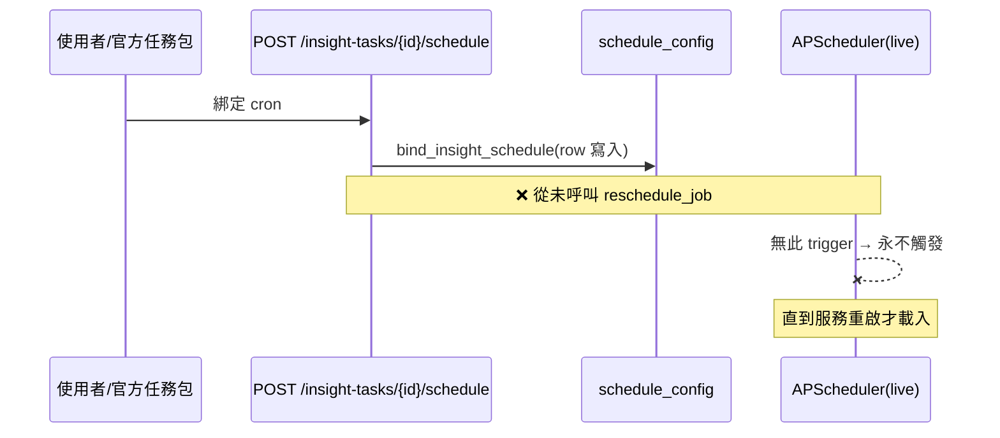
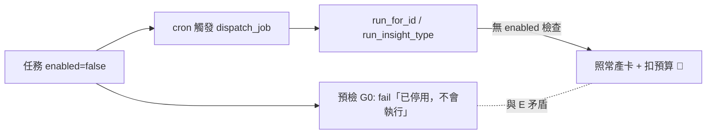
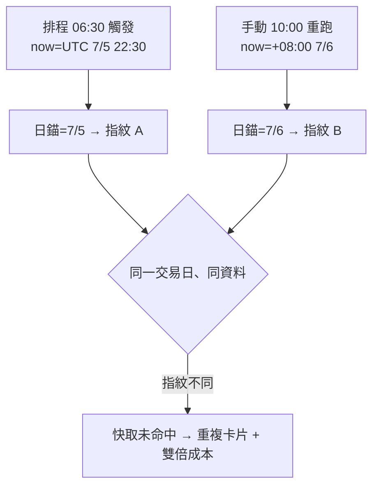
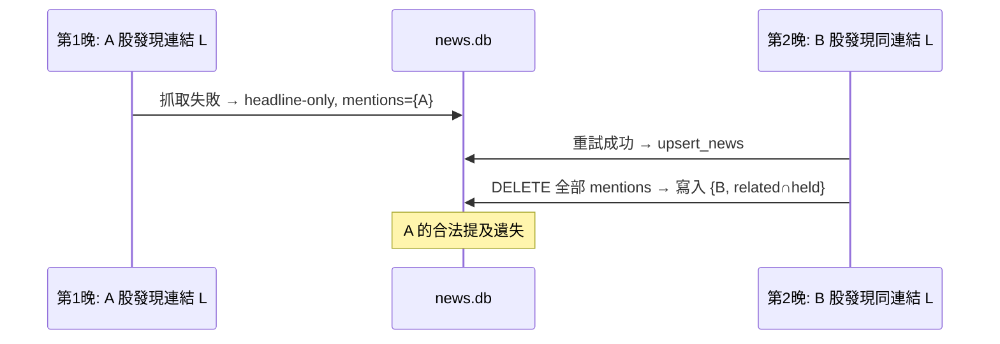

# 全系統深度審查報告(前後端 + 產品定位)— 2026-07-06

> **修復狀態(2026-07-07)**:owner 全數核准建議(Q1c/Q2a/Q3a/Q4a/Q5剝除/Q6確認台北
> 日錨 + Part B 全修)。修復批次已完成並部署測試站驗證 —— Part A 後端 14 項全修
> (H1/H2/M1/M2/L2/M3+Q1c/Q5/M5/L1/L3/L4/L6/L7;L5 依議延後)、Part B 前端 FH1–FH3 +
> FM1–FM10 全修 + 4 項便宜 LOW(戰績空狀態/觸控目標/表格邊緣淡出/新聞關鍵字搜尋+名稱),
> 延後 4 項 LOW(敘事數字格式/紅色語義/trades 留白/抽屜幣別截斷)。閘門:1323 passed、
> mypy 162 檔零錯、ruff、19 e2e。真站驗證 20/20(含停用任務 409、無效 cron 400、彈窗
> 不透明、鈴鐺顯示名+百分比、產生洞察選單、額度 $3.80、遺留頁重導、手機標題橫排)。
> commits `3218d22`…`c7ec861` @ 測試站。

> 審查配置:3 個 Fable 5(xHigh)subagent 並行 —— ①後端架構與運作流程 ②前端 UI/UX
> 國際產品級 ③AI 投資助手發展藍圖(獨立文件)。
> 對象:分支 `feat/task-pack-and-composer-cleanup` @ `b27aacd`(部署測試站,v0.1.10 之後
> 四個批次:任務包/per_market/技術訊號+F&G/新聞管線+新聞頁,未併版)。

---

## Part A — 後端架構與運作流程深審

### A1 裁決

**SOUND-WITH-FOLLOWUPS** —— 計算核心、Decimal 線路契約、七大不變式全部成立;但發現
**2 個 HIGH 級控制面缺陷**(排程掛載不同步、任務停用旗標未在執行層強制)加 1 個系統性
雙時鐘問題(cron=UTC vs API=台北),建議 v0.1.11 出版前修復。

### A2 閘門(審查 agent 自行實跑)

| 閘門 | 結果 |
| --- | --- |
| pytest(排除 e2e) | exit 0 — 1282 passed / 3 skipped |
| mypy --strict | 161 檔零錯 |
| ruff | 全過 |

### A3 架構評估:合規,零層界違規

- `news/` 只依賴 shared+stdlib;conn 接線正確落在 `api/news_service.py`;排程走
  `register_news_runner` seam。
- `llm_insight/generate.py` 保持純函數;唯一帶 conn 的接縫在 `api/insight_service.py`。
- 技術訊號/市場切片全在計算核心;Decimal 端到端(僅 XIRR 解算器與 provider 邊界有
  float,皆為既有且標準)。
- **七大不變式跨四批次重新稽核:零違規。**

### A4 發現(分級;先前 Opus 深審已修 9 項已驗證不重報)

#### HIGH(出版前必修)

**H1 — 洞察排程掛載/卸載從不同步 live APScheduler(CONFIRMED)**
新任務綁 cron(或一鍵官方套組)只寫 `schedule_config` 資料列,**live 排程器直到服務重啟
才載入** → 新排程永不觸發,但預檢 G1 卻回報「已排程」正常;反向:刪除任務後 live trigger
仍每次觸發並落 KeyError 錯誤。

**H2 — 任務 `enabled` 停用旗標只是顯示用;停用的任務照跑照扣錢(CONFIRMED)**
預檢 G0 明說「任務已停用,不會執行」,但 cron 派發、手動執行、產卡路徑**都沒有檢查
enabled** → 使用者停用健檢想省成本,週一 cron 照樣產 N 張卡+影子批次扣預算。另外
archived(已刪)任務仍可被手動 re-run。

#### MEDIUM

**M1 — 雙時鐘:cron 用 UTC、API 用台北(CONFIRMED)**
台北 00:00–07:59 之間兩者對「今天」不一致 → (i) v0.1.10 修好的日錨快取在排程路徑
重新失效(排程跑+手動跑指紋不同 → 重複卡+雙倍成本);(ii) 同一提示詞內 `{{now}}`
是 +08:00、`{{as_of}}` 是 UTC 混用;(iii) 01:30 備份檔名標成前一天;(iv) 06:00 新聞
day-walk 停在 UTC 昨天 → 當天早晨台股新聞晚一晚才入庫;(v) 執行歷史時間戳不一致。

**M2 — headline-only 升級時提及索引被整組抹除(CONFIRMED;兩個先前修復交互作用產生的新回歸)**
`upsert_news` 先 DELETE 全部 mentions 再重寫 → 連結先在 A 股名下降級存標題、後來在
B 股名下重試成功時,A 股的合法 discovered_for 提及遺失 → A 的健檢卡查不到自己來源的新聞。
修法:合併而非取代。

**M3 — 官方套組冪等以「任務名稱」為鍵:改名後再點會重複建立(含週排程)→ 雙倍成本(CONFIRMED)**
修法:加 preset 來源鍵,或至少偵測「同官方策略已被引用」時警示。

**M4 — Loop-2 基準價=「產卡日之後」的收盤 —— 模型沒看過的數字(CONFIRMED,規格模糊)**
週一 09:00 產卡時模型讀的是週五收盤,評分卻從週一收盤起算 → 第一天的行情被系統性排除/
錯置,影響命中率→校正→晉升整條進化鏈。三個選項待你裁決(見 A6-Q1)。

**M5 — cron 派發路徑無重疊防護(手動路徑有)** — cron 與進行中的手動跑同任務相撞會整批
重複產卡(race 窗口=整個 LLM 呼叫時長)。機率低、成本實在。

#### LOW(不阻擋出版)

| # | 內容 |
| --- | --- |
| L1 | news.db 不在每日備份+完整性檢查範圍;也無保留策略(每晚 ~45 列成長)→ 待你決定(A6-Q4) |
| L2 | 已封存任務的到期卡仍被評分(含 master 敘事評分成本)→ 一行 WHERE 可修 |
| L3 | 預覽用 180 天收盤、執行用 400 天 → technical_signals 預覽與實跑不一致 |
| L4 | 影子/正式卡共用指紋命名空間(極窄邊角) |
| L5 | session token 永不過期(單人自用,備註) |
| L6 | 上櫃(TPEx)標的 yfinance 新聞只試 .TW 不試 .TWO(FinMind 仍涵蓋,靜默降級) |
| L7 | 兩處評分函數用 wall-clock 而非注入時鐘(測試決定性,無使用者影響) |

**無 CRITICAL 發現。**

### A5 邏輯衝突與流程風險(跨功能稽核)

1. **預檢 vs 執行雙重真相**(G0/G1 說的與 runtime 做的相反)= H1+H2 的本質。
2. **日錨快取 × cron UTC 時鐘** = M1;v0.1.10 的修復只覆蓋了手動路徑。
3. **新聞兩個修復的組合**產生 M2(各自單獨都正確)。
4. **per_market × Loop-2**:市場卡若模型越權給出 prediction,評分會拿 "TW" 查價 →
   每日 defer 最後 undetermined(防毒成立,但是死重循環)→ 建議存卡時剝除(A6-Q5)。
5. **per_market 切片防漏:PASS**(僅 ex_div 日曆會掉 currency=None 事件的小屑)。
6. **調整成本/股利不重計/FX 歸因:PASS**。
7. **排程時序(台北)**:01:30 備份 → 06:00 新聞(先於 09:00 洞察 cron ✓)→ 14:xx 台股
   收盤鏈 → 15:00 預警 → 18:00 評分 → 週日 19:00 校正 → 23:50 快照。**順序連貫**;
   news_daily 與帳本庫的併發經 WAL+busy timeout 良性。
8. **預算治理:PASS**(每個 LLM 入口都復檢;最多超支一次呼叫的成本,固有可接受)。

### A6 待你理清的提問(規格模糊,審查 agent 不擅自猜)

| # | 問題 | 選項 |
| --- | --- | --- |
| Q1 | Loop-2 基準價語意 | (a) 維持「產卡日之後首個收盤」 (b) 改「產卡日之前最後收盤」(模型實際看到的) (c) 產卡時把所見價格存進 input_snapshot,精確對帳(**建議 c**) |
| Q2 | 停用任務+已綁排程 | (a) 執行層跳過並記 `task_disabled`(**建議**) (b) 停用時自動解綁 (c) 維持現狀照跑 |
| Q3 | 官方套組識別 | (a) 加 preset 來源鍵(**建議,套組會再長大**) (b) 「引用官方策略」啟發式 (c) 維持名稱鍵+文件註記 |
| Q4 | news.db 保護 | (a) 納入每日備份(第二個 gz,便宜,**建議**) (b) 接受可重抓、放棄成本歷史 (c) 獨立輕量輪替;另:organized_news 要不要設保留上限? |
| Q5 | per_market 預測 | 存卡時剝除 prediction(**建議**)或保留 defer→undetermined 循環 |
| Q6 | 業務日錨定時區 | 確認 Asia/Taipei 是唯一日錨(即 cron 的 UTC 是 bug 不是設計)(**建議確認**) |

### A7 修復優先序

**v0.1.11 出版前(阻擋項/便宜清楚)**:H1(排程同步)→ H2(enabled 強制)→ M1(app-tz
時鐘+回歸測試)→ M2(mentions 合併)→ L2(一行 WHERE)→ M3(至少文件註記)。

**出版後(需你裁決或低風險)**:M4(Q1)、M5(重疊防護)、L1(Q4)、L3(統一預覽窗口)、
per_market 預測剝除(Q5)、L4/L5/L6/L7。

---

## Part B — 前端 UI/UX 國際產品級審查

> 覆蓋:16 頁 × 桌面(1440)+ 手機(390)× 深/淺色 = **64 次儀器化載入**(CLS/溢出/
> console/失敗請求全量測)+ 互動流程(標的抽屜、⌘K 搜尋、主題切換、洞察三分頁、
> 管線抽屜+精靈四步、新聞過濾+彈窗、行動導覽、預警鈴)。零觸發付費動作。

### B1 裁決:總體 B —— 骨架是國際級,被 ~10 個可修缺陷拖住,且集中在「注意力表面」

| 面向 | 評級 |
| --- | --- |
| 視覺完成度 | B+ |
| 一致性 | B |
| **行動端** | **C+** |
| 資訊架構/流程 | B+ |
| 智能助手體驗達成度 | B− |

**基線品質(全數實測)**:64/64 載入 **0 console 錯誤、0 頁面錯誤、0 失敗請求、0 水平
溢出**;金額全站 IBM Plex Mono + tabular-nums + 千分位;ECharts 主題切換正確重繪;
**來源誠實性堪稱模範**(「規則引擎・非 AI 生成」「純敘述・無預測」、逐卡 token 成本)。

### B2 發現(分級)

#### HIGH

| # | 發現 | 根因/修法 |
| --- | --- | --- |
| FH1 | **新聞彈窗全透明** —— 標題/內文直接浮在暗化列表上,底下標題透出 | news.html 用了不存在的 CSS token(`--surface-1`/`--line`,實際是 `--panel`/`--border-soft`)→ 背景解析失敗變透明。**兩行修** |
| FH2 | **預警鈴(全 app 第一注意力表面)印原始機器值** —— `weight 0.7528455359184524…> 0.30`、原始帳戶 id `moomoo_my_us`、英文碎片 `ex-date in 3d` | 監控承諾的旗艦表面讀起來像 debug log。改走 format.js(「權重 75.3%＞門檻 30%」)+ 帳戶顯示名 + 全中文 |
| FH3 | **洞察頁「產生洞察」主按鈕永久 disabled + 過時提示**(「llm_insight 模組完工後啟用」—— 但 LLM 早在 v0.1.10 出貨,同頁卡片都帶 token 成本);且視覺上看起來可點、點了無反應 | 接上手動觸發(或深連到洞察管線)+ 全域 disabled 樣式 |

#### MEDIUM(10 項)

| # | 發現 |
| --- | --- |
| FM1 | **手機 CJK 直向塌縮(系統性 flex bug)**:「交/易/輸/入」「持/倉/週/報」一字一行直排(panel-title / pp-card-name 無 min-width) |
| FM2 | 待確認匯入收件匣在手機保留三欄桌面網格 → 一張股利卡 ≈ 兩個螢幕高 |
| FM3 | **非同步載入排版跳動**:實測 CLS —— index 手機 **0.94**、trades 桌面 0.70、index 桌面 0.59(Google「差」門檻 0.25)→ 需骨架列+min-height |
| FM4 | **提案時代文案上線**:pipeline-hub 標題「(重構提案)」、橫幅「重構提案 v1」、「可全部退回原名」對照表;資產卡數字寫死(「9 類 32 個」)會默默腐化 |
| FM5 | 管線任務卡印原始 Decimal「額度餘 $3.8014615」(精靈側欄同值卻正確顯示 $3.80 —— fmt seam 存在但卡片繞過了) |
| FM6 | **兩個遺留頁面還活著**:ledger.html(過時日期過濾會**藏掉 7 月交易**)與 input.html —— 舊書籤會落在重複/過時 UI → 應重導 trades.html |
| FM7 | 持倉健診分頁 = ~36 張幾乎相同的卡片牆(每標的×每歷史批次),無分組無判定色 → 應改「每標的最新+狀態色+歷史下鑽」 |
| FM8 | settings-prompts 儲存列夾在自我進化設定的欄位中間,兩個儲存範圍交錯 |
| FM9 | **信任受損文案**:settings.html 仍寫「設計稿:帳號密碼存於本機瀏覽器(localStorage)」—— 與已出貨的後端 session 認證矛盾,且對財務 app 是嚇人的措辭 |
| FM10 | 爬取垃圾直出:一則新聞摘要寫著「文章內容主要為網頁CSS程式碼和HTML標籤…」(花 $0.0042 摘要了 CSS)→ 抽取失敗應標記/排除,不該敘述 |

#### LOW/POLISH(9 項精選)

觸控目標 28–36px(<44px 標準)· 手機持倉表切在數字中間無滑動提示 · 新聞過濾下拉只有
代號無名稱、無關鍵字搜尋 · AI 戰績空狀態渲染 0.00% 像不及格成績單(應寫「尚無到期預測
— 最早 7/9 對答案」)· 產業分類中英混雜 · 卡片敘事印「3,787,171.2500 TWD」(TWD 慣例
0 位)· 手機抽屜標題切掉幣別 · 紅色雙語義(虧損綠/負現金紅)· trades 桌面表單下大片留白。

### B3 每頁計分卡

| 頁面 | 桌深 | 桌淺 | 機深 | 機淺 | 備註 |
| --- | --- | --- | --- | --- | --- |
| index | A− | A− | B− | B− | 全 app 密度最佳;手機 KPI 換行+CLS 0.94 |
| trades | B | B | C+ | C+ | 直排標題、收件匣壓縮、CLS 0.70 |
| cash | B+ | B+ | B | B | 乾淨;紅色語義張力 |
| instruments | A− | A− | B+ | B+ | 中英混雜產業 |
| insights | B− | B− | B− | B− | 死按鈕+健診卡牆+戰績空狀態 |
| pipeline-hub | B+ | B+ | B | B | 模型優秀;提案文案+原始小數 |
| **news** | **C+** | **C+** | **C+** | **C+** | 透明彈窗拖垮整頁 |
| settings-llm | A− | A− | B+ | B+ | 模型註冊+額度治理:產品級 |
| settings-datasources | A− | A− | B+ | B+ | 強營運頁 |
| login | A− | A− | A− | A− | 極簡乾淨 |
| ledger/input(遺留) | C | C | C | C | 應重導 |

(其餘 settings 頁 B~B+,零 console 錯誤全站成立。)

### B4 Top-10 改進(影響÷成本排序)

1. 修 news.html 兩個未定義 CSS token(分鐘級,移除最糟視覺缺陷)
2. 預警鈴格式化(百分比+顯示名+中文)—— 對「監控」承諾**單點最高槓桿**的可信度修復
3. 接活/重定位「產生洞察」按鈕 + 全域 disabled 樣式
4. 管線額度走 fmt($3.80)
5. 手機 CJK 塌縮+收件匣堆疊(一次 CSS pass,手機從 C+ → B+)
6. KPI 帶/持倉表/圖表骨架+min-height(殺掉 0.5–0.9 的 CLS)
7. pipeline-hub 文案產品化(去「重構提案 v1」框架+資產卡數字改 API 取值)
8. 持倉健診改「每標的最新+判定色」+歷史下鑽
9. ledger.html/input.html 重導 trades.html
10. settings 文案債(刪 localStorage 設計稿註記;統一 prompts 頁儲存範圍)

### B5 智能助手體驗缺口

**已經到位的**:AI 卡就在儀表板右欄(不藏)、預警徽章+額度籤全站、DRIP 偵測收件匣是
真正的主動體驗、逐卡誠實標籤是模範。

**落差在**:
1. **注意力表面恰好是最粗糙的表面**(鈴鐺 FH2、健診卡牆 FM7)—— 使用者對「智能」的
   第一判斷發生在這裡。
2. **沒有「現在就看我的組合」的入口**(FH3 死按鈕;手動觸發藏在管線卡片裡)。
3. **建議不連動作**:卡片說「2412 將於 7/9 除息」但不連到持倉列/除息日曆/表單
   (`pdOpenSymbol` 管線早就存在,加 chip 連結即可)。
4. **戰績信任迴路空著且讀起來像失敗**(0.00% 滿版)—— 問責功能目前在**降低**信心。
5. **預警→洞察因果不可見**:精靈裡明明有「預警觸發」類型,卡片卻不顯示「本卡因預警 X
   而生」。

---

## Part C — AI 投資助手發展藍圖(摘要)

> 完整規劃案(10 節、差距矩陣、模組劃分、派工方案、整合流程、成本預估、mermaid 圖解)
> 見獨立文件 **`docs/reports/2026-07-06-ai-assistant-development-blueprint.md`**。

### C1 可行性裁決

**完全可行,且零鎖定決策變更** —— 兩大既有支柱(帳本/計算核心、四迴路 LLM 管線+32 變數
+官方模板庫 v3)已承載願景大半重量;差距集中在三處:**訊號深度、主動觸達、自我驗證**,
且全部對應到「已設計好但還空著的家」(`strategy/` 規則模組、通知葉、`portfolio/` 純計算、
兩個 available=False 的 ai 變數)。

### C2 報酬率極大化的誠實目標函數

助手能因果影響的是**風險調整後的決策品質**,不是市場報酬。文獻上個人投資者最大可收割的
「alpha」是行為缺口(1.2–4pp/年);趨勢規則買到的是回撤縮減而非原始報酬勝出。因此以
5 個本地可量測代理指標運營:命中率/校準度、對標基準的 XIRR 差、預警提前量、交易帳本
行為紀律、成本紀律。

### C3 分期路線(P0→P6)

| 期 | 內容 | 規模 |
| --- | --- | --- |
| **P0** | 出版 v0.1.11 + **prod LLM 點火**(阻擋項:Loop-2 目前 ~0 真實樣本) | S |
| P1 | 資料地基:量能回填 + 歷史 365d→3y + 分析師共識⑤ | M |
| P2 | **技術規則引擎** `strategy/rules/`:實證核心 4 規則 + TechScore + 參數版本戳 | L |
| P3 | 監控升級:預警分類 v2 + **推播通道** + 摘要信 | M-L |
| P4 | 回測事件研究 + 基準相對 XIRR + 決策帳本 + 點燃 backtest_json/calibration_gap_json | L |
| P5 | Vision/手動報告餵入⑥ | M |
| P6 | 長期顧問合成:季度深度報告、行為護欄、what-if 連動 | M |

### C4 五大差距(依阻擋程度)

1. **零推播通道** —— 純拉式 app 與「在對的時間主動提示」的承諾根本矛盾。
2. **strategy/ 規則引擎缺席** —— 技術訊號目前只是 LLM 變數,不是記錄性訊號。
3. **量能欄零回填 + 歷史上限 365 天** —— 擋住量能確認、MA200、以及任何回測。
4. **ROI 主張無驗證迴路** —— 無回測引擎、無基準相對 XIRR、無建議→行動→結果帳本。
5. **prod 未點火** —— 所有 Loop-2/3 進化的學習訊號斷糧,每一期的迴路都在餓。

### C5 五大待決(附建議)

| # | 決策 | 建議 |
| --- | --- | --- |
| D1 | 推播通道 | **ntfy**(次選 email) |
| D2 | 歷史深度 | **3 年** |
| D3 | 規則集 v1 範圍 | **實證核心 4**:MA200 趨勢濾網(帶遲滯)、50/200 交叉+量能確認、12-1 動能、RSI/52週位階脈絡 —— 指標動物園延後 |
| D4 | 回測形式 | **事件研究**(非全模擬,此規模 YAGNI) |
| D7 | prod 點火 | **現在**(P1 之前,阻擋級建議) |

---

## 綜合結論

### 總體狀態

| 維度 | 判定 |
| --- | --- |
| 後端架構/不變式 | **SOUND**(零層界違規、七不變式全成立、閘門全綠) |
| 控制面(排程/旗標) | **2 個 HIGH 待修**(H1/H2 —— 介面承諾與 runtime 不一致) |
| 前端骨架 | **國際級基礎**(64 載入零錯誤、零溢出、主題完整對等) |
| 前端注意力表面 | **~10 個可修缺陷**,恰好集中在監控/洞察等旗艦表面 |
| 產品願景可行性 | **完全可行、零鎖定決策變更**;差距=訊號深度/主動觸達/自我驗證 |

**無重大架構衝突、無資料損壞風險。** 所有 HIGH/MEDIUM 都是控制面或表現層問題,修法
明確、成本低;真正的策略性缺口(推播、規則引擎、回測驗證)已入藍圖分期。

### 建議行動順序

1. **審查修復批次(v0.1.11 出版前)** —— 後端:H1 排程同步、H2 enabled 強制、M1 雙
   時鐘、M2 提及合併、L2 封存排除;前端:FH1 彈窗 CSS、FH2 鈴鐺格式化、FH3 產生洞察
   按鈕、FM5 額度 fmt、FM4/FM9 文案債、FM6 遺留頁重導、FM1/FM2 手機 CSS pass。
   (約一個工作批次,全部有清楚修法。)
2. **回答兩組待決問題**(後端 Q1–Q6 + 藍圖 D1–D4/D7),特別是 **D7 prod 點火**(阻擋
   所有進化迴路)與 Q1(Loop-2 基準價,影響評分正確性)。
3. **出版 v0.1.11 + prod 點火**(= 藍圖 P0)。
4. 之後依藍圖 P1→P6 推進(資料地基 → 規則引擎 → 監控升級 → 回測驗證 → Vision → 顧問合成),
   CLS 骨架/健診重設計(FM3/FM7)可併入 P3 監控升級的前端批次。

---
*Human-facing review deliverable (Traditional Chinese per report precedent);
code artifacts remain English. No credentials appear in this file.*
